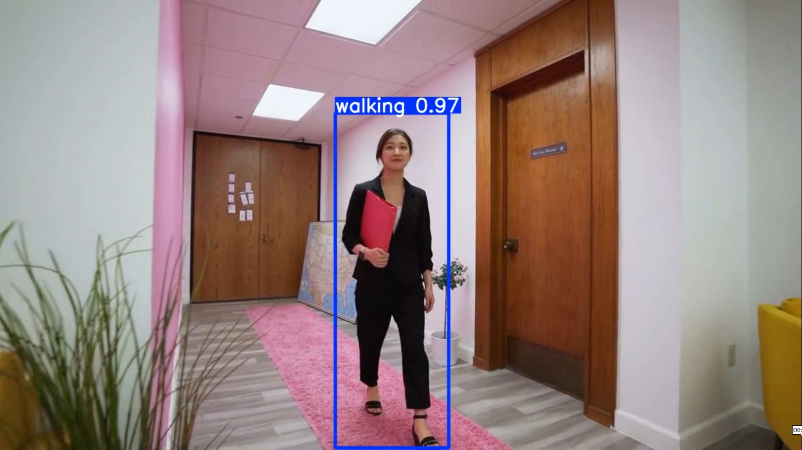
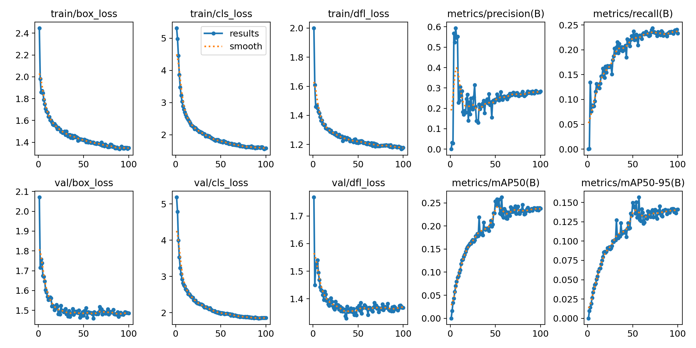
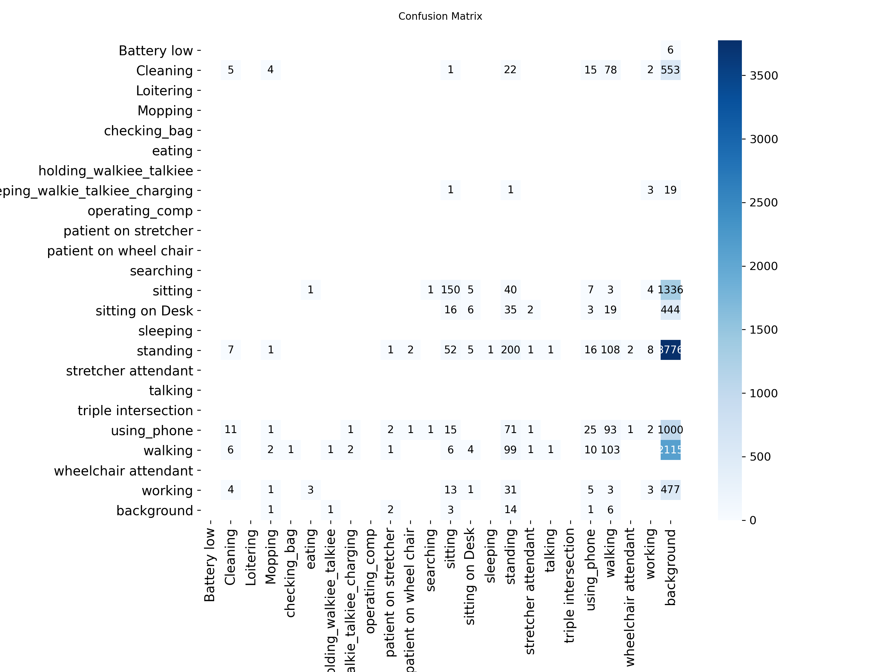
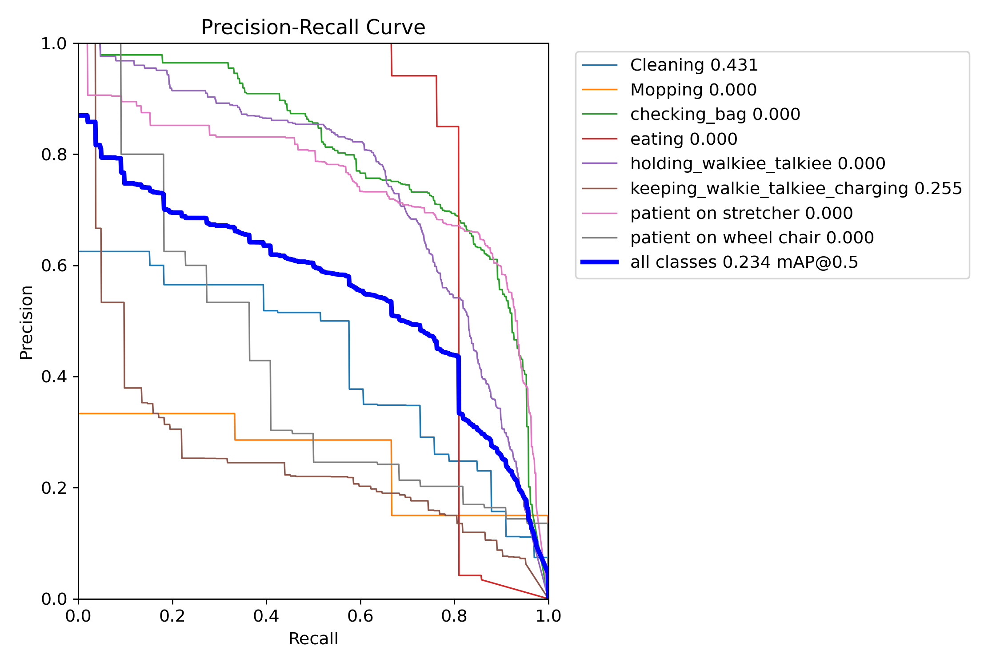
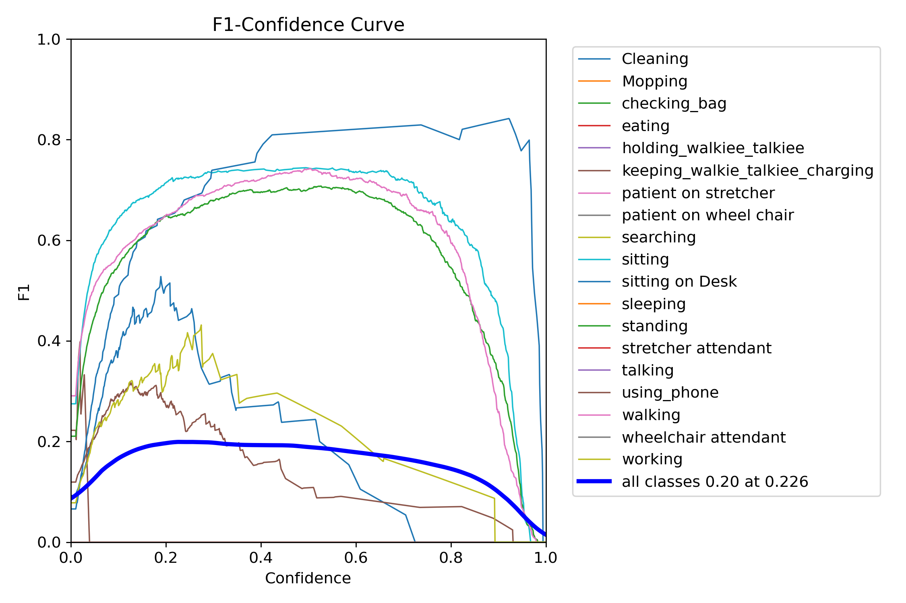
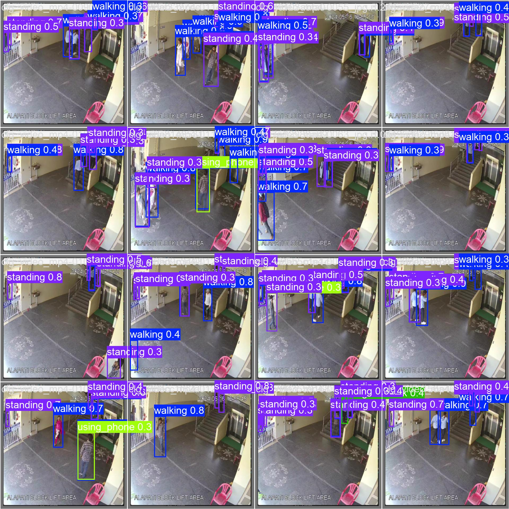
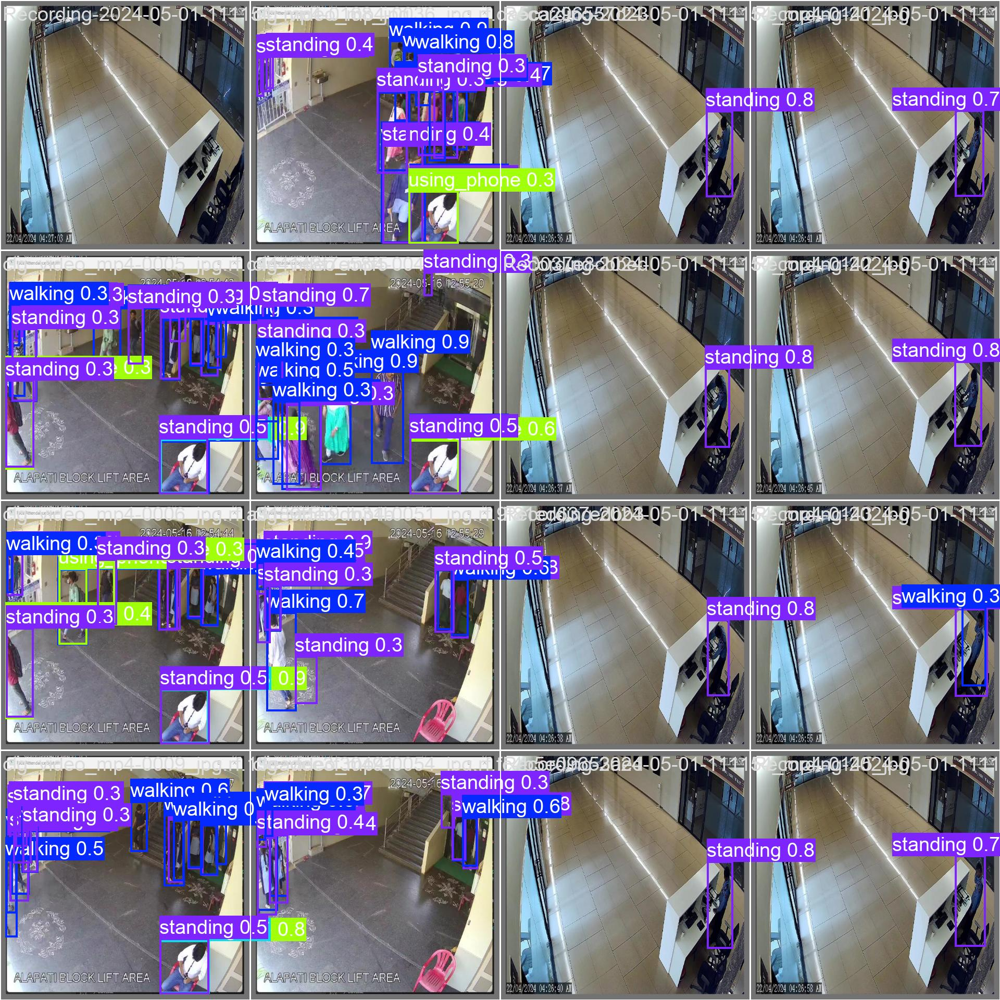

# Human Activity Detection

[](https://opensource.org/licenses/MIT)
[](https://www.python.org/downloads/)

A production-ready computer vision pipeline for detecting human activities using YOLO (YOLOv11). This project implements a complete training, evaluation, and inference pipeline optimized for GPU acceleration with CUDA support.

## 📹 Inference Results

### Example Detection


*Example detection: Walking activity in video*

### Output Video

**Inference Output**: [View Video](outputs/inference/output_video.mp4)

*Inference output video showing human activity detection (download to view).*

### Performance

- **Average detections per frame**: 2-4
- **Processing speed**: ~15ms per frame on MX450 GPU
- **Detected activities**: Standing, Walking, Using Phone
- **Output video**: `outputs/inference/output_video.mp4`

## 🎯 Features

- **YOLO-based Detection**: Uses YOLOv11 for fast and accurate human activity detection
- **23 Activity Classes**: Detects various human activities including:
  - Battery low, Cleaning, Loitering, Mopping
  - Checking bag, Eating, Using phone
  - Patient on stretcher/wheelchair
  - Sitting, Standing, Walking, Sleeping
  - And more...
- **GPU Acceleration**: Optimized for CUDA-enabled GPUs
- **Production Ready**: Structured codebase with proper logging, configuration management, and error handling
- **Complete Pipeline**: Training, evaluation, and inference modules
- **UV Package Manager**: Modern Python package management with UV

## 📋 Requirements

- Python 3.8+
- CUDA 12.4+ (for GPU acceleration)
- NVIDIA GPU with CUDA support
- Windows/Linux/macOS
- UV package manager (optional but recommended)

## 🚀 Quick Start

### 1. Install UV (if not installed)

```bash
# Windows (PowerShell)
powershell -ExecutionPolicy ByPass -c "irm https://astral.sh/uv/install.ps1 | iex"

# Linux/Mac
curl -LsSf https://astral.sh/uv/install.sh | sh
```

### 2. Setup with UV

```bash
# Windows (PowerShell)
.\scripts\setup_uv.ps1

# Linux/Mac
chmod +x scripts/setup_uv.sh
./scripts/setup_uv.sh
```

Or manually:

```bash
# Create virtual environment
uv venv

# Activate virtual environment
# Windows:
.\.venv\Scripts\Activate.ps1
# Linux/Mac:
source .venv/bin/activate

# Install dependencies
uv pip install -r requirements.txt

# Install PyTorch with CUDA (if needed)
uv pip install torch torchvision --index-url https://download.pytorch.org/whl/cu124
```

### 3. Verify CUDA Installation

```bash
# Check NVIDIA driver and CUDA
nvidia-smi

# Verify PyTorch CUDA support
python scripts/verify_setup.py
```

### 4. Prepare Dataset

Place your dataset in the following structure:

```text
data/
├── train/
│   ├── images/
│   └── labels/
├── valid/
│   ├── images/
│   └── labels/
└── test/
    ├── images/
    └── labels/
```

The dataset configuration is in `config/data.yaml`. Update paths if needed.

### 5. Training

```bash
# Train with default configuration
python -m src.train

# Or with custom config
python -m src.train --config config/training_config.yaml
```

Training outputs will be saved to `outputs/runs/` and the final model to `outputs/models/`.

### 6. Evaluation

```bash
# Evaluate trained model
python -m src.evaluate
```

### 7. Inference

```bash
# Run inference on images/videos
python -m src.inference

# Or specify custom source
python -m src.inference --source path/to/video.mp4
python -m src.inference --source 0  # Webcam
python -m src.inference --source data/test/images  # Directory
```

## 📁 Project Structure

```text
Human-Activity/
├── config/                 # Configuration files
│   ├── data.yaml          # Dataset configuration
│   ├── training_config.yaml
│   └── inference_config.yaml
├── data/                   # Dataset directory
│   ├── train/
│   ├── valid/
│   └── test/
├── docs/                   # Documentation
│   └── INSTALL_CUDA.md
├── models/                 # Pre-trained models
│   └── yolo11n.pt
├── src/                    # Source code
│   ├── __init__.py
│   ├── train.py           # Training module
│   ├── inference.py       # Inference module
│   ├── evaluate.py        # Evaluation module
│   └── utils.py           # Utility functions
├── scripts/                # Utility scripts
│   ├── quick_start.py
│   ├── verify_setup.py
│   ├── setup_uv.sh
│   └── setup_uv.ps1
├── outputs/                # Output directory
│   ├── models/            # Trained models
│   ├── runs/              # Training runs
│   └── inference/         # Inference results
├── logs/                   # Log files
├── pyproject.toml          # UV/Python project config
├── requirements.txt        # Python dependencies
└── README.md              # This file
```

## ⚙️ Configuration

### Training Configuration (`config/training_config.yaml`)

Key parameters:

- `model.name`: Model architecture (yolo11n.pt, yolo11s.pt, etc.)
- `training.epochs`: Number of training epochs
- `training.batch_size`: Batch size (adjust based on GPU memory)
- `training.device`: GPU device ID or 'cpu'
- `augmentation`: Data augmentation settings

### Inference Configuration (`config/inference_config.yaml`)

Key parameters:

- `model.checkpoint_path`: Path to trained model
- `model.conf_threshold`: Confidence threshold (0.3 default in this repo)
- `input.source`: Input source (image, video, directory, or webcam)
- `output.save_dir`: Output directory

## 🔧 GPU Configuration

### For CUDA 12.4

The project uses PyTorch with CUDA support. Install PyTorch with specific CUDA version:

```bash
# Using UV
uv pip install torch torchvision --index-url https://download.pytorch.org/whl/cu124

# Or using pip
pip install torch torchvision --index-url https://download.pytorch.org/whl/cu124
```

### Check GPU Usage

```bash
# Monitor GPU during training
nvidia-smi -l 1
```

## 📊 Monitoring Training

### TensorBoard

```bash
# Launch TensorBoard
tensorboard --logdir outputs/runs

# Open browser to http://localhost:6006
```

### Logs

Training logs are saved to `logs/human_activity_detection.log`.

## 📈 Training Results

### 100 Epochs Training (MX450 GPU, 2GB VRAM)

**Training Time**: 42.159 hours (~1.75 days)

#### Training Metrics


*Training loss curves and metrics over 100 epochs*


*Confusion matrix showing class-wise performance*


*Precision-Recall curves for all classes*


*F1 score curve over training epochs*

#### Validation Predictions


*Validation predictions - Batch 0*


*Validation predictions - Batch 1*

**Best Model Metrics**:

- **mAP50**: 0.234 (23.4%)
- **mAP50-95**: 0.133 (13.3%)
- **Precision**: 0.225 (22.5%)
- **Recall**: 0.236 (23.6%)

**Per-Class Performance** (Best Model):

| Class | mAP50 | Recall | Status |
| ----- | ----- | ------ | ------ |
| `sitting` | 79.8% | 87.2% | ✅ Excellent |
| `sitting on Desk` | 79.8% | 81.0% | ✅ Excellent |
| `walking` | 74.8% | 93.0% | ✅ Excellent |
| `standing` | 74.1% | 78.8% | ✅ Excellent |
| `Cleaning` | 43.1% | 39.4% | ⚠️ Moderate |
| `using_phone` | 25.3% | 26.8% | ⚠️ Moderate |
| `working` | 41.5% | 22.7% | ⚠️ Moderate |
| `Mopping` | 0% | 0% | ❌ Poor (no detections) |
| `checking_bag` | 0% | 0% | ❌ Poor (no detections) |
| `eating` | 0% | 0% | ❌ Poor (no detections) |
| ... (11 more classes with 0% detection) | | | ❌ Poor |

**Key Observations**:

- ✅ **Strong performance** on common activities: sitting, walking, standing (70-80% mAP50)
- ⚠️ **Moderate performance** on less common activities: cleaning, using phone (20-45% mAP50)
- ❌ **Poor/zero performance** on rare activities: many classes with 1-6 training instances show 0% detection
- 📊 **Class imbalance**: Dataset has significant class imbalance (e.g., 513 standing vs 1-6 instances for rare classes)

**Recommendations for Improvement**:

1. **More training data**: Collect more samples for rare classes (Mopping, checking_bag, eating, etc.)
2. **Data augmentation**: Increase augmentation for underrepresented classes
3. **Longer training**: Consider 200+ epochs for better convergence
4. **Class weighting**: Use class weights to balance loss for rare classes
5. **Transfer learning**: Consider fine-tuning from a model pre-trained on similar human activity datasets

### Inference Results (100 Epochs Model)

After 100 epochs of training, the model successfully detects activities in video:

**Test Video**: `human_activity_video.mp4` (204 frames)

**Detected Activities**:

- ✅ **Standing**: Consistently detected (2-4 detections per frame)
- ✅ **Walking**: Detected when present (1-2 detections per frame)
- ✅ **Using Phone**: Detected intermittently (1 detection per frame when present)

**Performance**:

- Average detections per frame: 2-4
- Processing speed: ~15ms per frame on MX450 GPU
- Output video saved to: `outputs/inference/output_video.mp4`

**Known Issues**:

⚠️ **Class Imbalance Problem**: The model shows bias towards dominant classes:

- People sitting at desks are often misclassified as "standing" instead of "working" or "sitting on Desk"
- This occurs because "standing" has 513 training instances vs. only 22 for "working" (23:1 ratio)
- The model defaults to "standing" when uncertain due to class imbalance

**Solutions**:

1. **Lower Confidence Threshold**: Updated to 0.35 (from 0.55) to allow more detections of underrepresented classes
2. **Retrain with Class Weighting**: Implement weighted loss to penalize misclassification of rare classes
3. **Collect More Data**: Prioritize collecting more "working" and "sitting on Desk" samples
4. **Use Improved Inference**: See `src/inference_improved.py` for post-processing that helps with rare classes

**Observations**:

- Model detects people consistently (2-4 detections per frame)
- Detections are stable across frames
- Model correctly identifies multiple people in the scene
- **Misclassification**: Due to class imbalance, "working" activities are often labeled as "standing"
- See [Dataset Findings](docs/DATASET_FINDINGS.md) for detailed analysis

## 🐛 Troubleshooting

### CUDA Out of Memory

If you encounter CUDA out of memory errors:

1. Reduce `batch_size` in `config/training_config.yaml`
2. Reduce `imgsz` (image size)
3. Disable `cache` option
4. Use a smaller model (yolo11n.pt instead of yolo11s.pt)
5. On Windows, keep `workers: 0` or `workers: 1` (higher values can trigger paging-file errors)

### Model Not Found

If inference fails with "Model not found":

1. Train a model first: `python -m src.train`
2. Update `model.checkpoint_path` in `config/inference_config.yaml`
3. Check that model exists in `outputs/models/`

### Poor Detection Accuracy / Misclassification

If you see incorrect activity labels (e.g., "standing" instead of "working"):

1. **Class Imbalance Issue**: This is the primary cause. "standing" has 513 instances vs. 22 for "working" (23:1 ratio), causing the model to default to "standing".

2. **Immediate Fixes**:
   - Lower confidence threshold in `config/inference_config.yaml` (already set to 0.35)
   - Use improved inference: `python -m src.inference_improved --source video.mp4`
   - Check if "working" or "sitting on Desk" appear with lower confidence scores

3. **Training Solutions**:
   - **Collect more data**: Prioritize "working" and "sitting on Desk" samples (target: 50+ each)
   - **Class weighting**: Implement weighted loss function in training
   - **Train longer**: 200+ epochs may help, but data imbalance is the root cause
   - **Data augmentation**: Apply aggressive augmentation specifically to rare classes

4. **Verification**:
   - Check validation results: `outputs/runs/.../val_batch*_pred.jpg`
   - Review class distribution: see [Dataset Findings](docs/DATASET_FINDINGS.md)
   - Verify training data has sufficient "working" samples

5. **Sanity Checks**:
   - Very low epochs (e.g., 1) often produces **no detections** on video
   - For MX450 (2GB), start with **50 epochs** minimum
   - Ensure dataset is properly organized in `data/` structure

### Path Issues

All paths in configuration files are relative to project root. Use absolute paths if needed.

## 📝 Dataset Information

### Dataset Details

- **Source**: [Roboflow Universe](https://universe.roboflow.com/cctv-rfavb/human-activity-kynyq)
- **Dataset Name**: Human Activity - v3 (2024-07-01)
- **License**: CC BY 4.0
- **Format**: YOLOv8/YOLOv11 format
- **Classes**: 23 human activity classes
- **Total Images**: 2,291 images
- **Annotation Format**: YOLOv8 format
- **Train/Val/Test Split**: Configured in `config/data.yaml`

### Preprocessing

The following pre-processing was applied to each image:

- Auto-orientation of pixel data (with EXIF-orientation stripping)
- Resize to 640x640 (Stretch)

### Class Names

The dataset includes 23 activity classes:

- Battery low, Cleaning, Loitering, Mopping
- checking_bag, eating, holding_walkiee_talkiee
- keeping_walkie_talkiee_charging, operating_comp
- patient on stretcher, patient on wheel chair
- searching, sitting, sitting on Desk, sleeping
- standing, stretcher attendant, talking
- triple intersection, using_phone, walking
- wheelchair attendant, working

### Dataset Access

- **Roboflow URL**: <https://universe.roboflow.com/cctv-rfavb/human-activity-kynyq>
- **Export Date**: August 29, 2024
- **Platform**: [Roboflow](https://roboflow.com) - End-to-end computer vision platform

For state-of-the-art Computer Vision training notebooks, visit [Roboflow Notebooks](https://github.com/roboflow/notebooks).

### Dataset Findings

See [docs/DATASET_FINDINGS.md](docs/DATASET_FINDINGS.md) for detailed analysis of:

- Class distribution and imbalance issues
- Impact on model performance
- Recommendations for improvement
- Expected vs. actual performance by class frequency

## 📚 Documentation

- `README.md`: This file (main documentation)
- `docs/INSTALL_CUDA.md`: CUDA installation guide
- `docs/MODEL_TRAINING.md`: Detailed training guide
- `docs/DATASET_FINDINGS.md`: Dataset analysis and class distribution findings
- `docs/INFERENCE_ISSUES.md`: Common inference problems and solutions (including "working" misclassification)
- `docs/FALSE_POSITIVES.md`: False positive detection issues and filtering solutions

## 🤝 Contributing

Contributions are welcome! Please see [CONTRIBUTING.md](CONTRIBUTING.md) for guidelines.

1. Follow the existing code structure
2. Add proper logging and error handling
3. Update documentation
4. Test with your dataset

## 📄 License

- **Code**: MIT License (see [LICENSE](LICENSE) file)
- **Dataset**: CC BY 4.0 (from Roboflow Universe)

## 🔗 Links

- **GitHub Repository**: [https://github.com/AdnanSattar/human_activity_detection](https://github.com/AdnanSattar/human_activity_detection)
- **Dataset Source**: [Roboflow Universe](https://universe.roboflow.com/cctv-rfavb/human-activity-kynyq)

## 🙏 Acknowledgments

- Dataset provided by Roboflow Universe
- YOLO implementation by Ultralytics
- CUDA support by NVIDIA

## 📧 Support

For issues or questions:

1. Check the logs in `logs/` directory
2. Verify CUDA installation with `nvidia-smi`
3. Ensure dataset paths are correct in `config/data.yaml`
4. Run `python scripts/quick_start.py` for diagnostics

---

**Note**: Make sure your GPU has sufficient memory (at least 2GB recommended). The MX450 with 2GB should work with batch_size=8 and imgsz=640.
